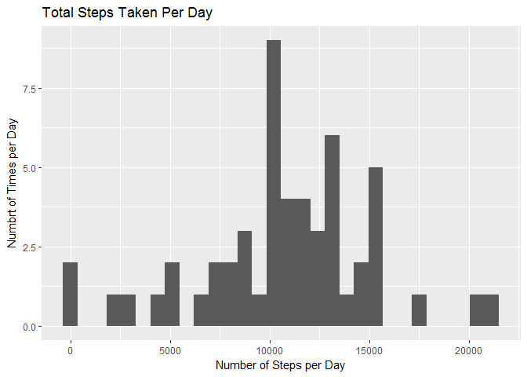
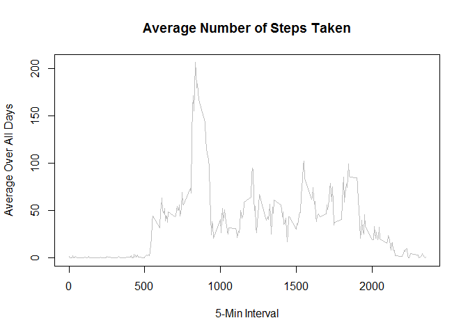
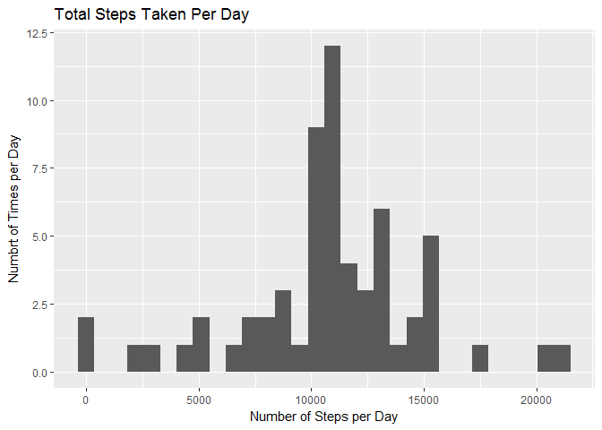
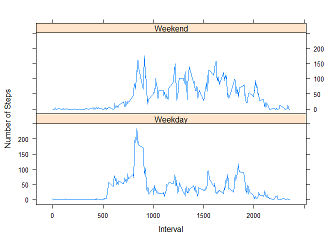

Project 1 Assignment - Reproducible Research
============================================

Here, we're going to load the activity data for the assignment:

    #Call to load the dataset:
    activity <- read.csv("C:/Users/Phil/Documents/Data_Science/Reproducible_Research/activity.csv")

    #Call to omit all NA values from the dataset
    activity_naremoved <- na.omit(activity)

    #Call to summarize the modified dataset
    summary(activity_naremoved)

    ##      steps                date          interval     
    ##  Min.   :  0.00   2012-10-02:  288   Min.   :   0.0  
    ##  1st Qu.:  0.00   2012-10-03:  288   1st Qu.: 588.8  
    ##  Median :  0.00   2012-10-04:  288   Median :1177.5  
    ##  Mean   : 37.38   2012-10-05:  288   Mean   :1177.5  
    ##  3rd Qu.: 12.00   2012-10-06:  288   3rd Qu.:1766.2  
    ##  Max.   :806.00   2012-10-07:  288   Max.   :2355.0  
    ##                   (Other)   :13536

Next, we're going to calculate a few items from the dataset:

First, we'll calculate the total number of steps taken per day. To do
this, we'll use the aggregate function

    #Calculates the total number of steps taken per day
    number_steps_per_date <- aggregate(activity_naremoved$steps, list(activity_naremoved$date), sum)
    colnames(number_steps_per_date) <- c("date", "steps")

Next, we'll plot a histogram using this data

    #Plots a histogram of the data using library ggplot2
    library(ggplot2)
    ggplot(data=number_steps_per_date, aes(x=steps)) +
            geom_histogram() +
            ggtitle("Total Steps Taken Per Day") +
            labs(x="Number of Steps per Day", y="Numbrt of Times per Day")

    ## `stat_bin()` using `bins = 30`. Pick better value with `binwidth`.

We now want to calculate the mean and median total steps per date from
our dataset:

    #Calculate the mean and median
    mean_steps_per_date <- mean(number_steps_per_date$steps)
    median_steps_per_date <- median(number_steps_per_date$steps)

    #Outputs the mean and median
    mean_steps_per_date

    ## [1] 10766.19

    median_steps_per_date

    ## [1] 10765

    #Time Series Plot
    steps_per_interval <- aggregate(activity_naremoved$steps, by = list(interval = as.factor(activity_naremoved$interval)), FUN=mean, na.rm=TRUE)
    steps_per_interval$interval <- as.integer(levels(steps_per_interval$interval)[steps_per_interval$interval])
    colnames(steps_per_interval) <- c("interval", "steps")

    time_series <- tapply(activity_naremoved$steps, activity_naremoved$interval, mean, na.rm = TRUE)

    plot(row.names(time_series), time_series, type = "l", xlab = "5-Min Interval", 
        ylab = "Average Over All Days", main = "Average Number of Steps Taken", 
        col ="gray")

    #Calculation of Max Interval
    max_interval <- steps_per_interval[which.max(steps_per_interval$steps),]
    max_interval

    ##     interval    steps
    ## 104      835 206.1698

    #Calculates and returns the total count of NA values in the dataset
    total_na <- sum(is.na(activity))
    total_na

    ## [1] 2304

    #Aggregates a simplified dataset, similar to above
    number_steps_per_date_wna <- aggregate(activity$steps, list(activity$date), sum)
    colnames(number_steps_per_date_wna) <- c("date", "steps")

    #A loop that runs through the steps column of the dataset, inputting the mean steps per day where NA is present to create a new dataset
    for (i in 1:nrow(number_steps_per_date_wna)){
            tmp <- number_steps_per_date_wna$steps[i]
            if(is.na(tmp)){
                    number_steps_per_date_wna$steps[i] <- mean_steps_per_date
            }
    }
    #Prints the header of the new dataset
    head(number_steps_per_date_wna)

    ##         date    steps
    ## 1 2012-10-01 10766.19
    ## 2 2012-10-02   126.00
    ## 3 2012-10-03 11352.00
    ## 4 2012-10-04 12116.00
    ## 5 2012-10-05 13294.00
    ## 6 2012-10-06 15420.00

    #Plots the new dataset
    ggplot(data=number_steps_per_date_wna, aes(x=steps)) +
            geom_histogram() +
            ggtitle("Total Steps Taken Per Day") +
            labs(x="Number of Steps per Day", y="Numbrt of Times per Day")

    ## `stat_bin()` using `bins = 30`. Pick better value with `binwidth`.

    #Calculation of new mean and median
    new_mean <- mean(number_steps_per_date_wna$steps)
    new_median <- median(number_steps_per_date_wna$steps)

    new_mean

    ## [1] 10766.19

    new_median

    ## [1] 10766.19

    #The new value of the median differs slightly from the previous calculation, while the means have remained the same.
    #The result of imputing missing data on the estimates is very small, and arguably insigificant

    #Code to convert dates into Weekend or Weekdays, using as.Date and a for loop, with if call
    date_convert <- as.Date(activity_naremoved$date)
    weekdays_dataset <- weekdays(date_convert, abbreviate = TRUE)

    for (i in 1:length(weekdays_dataset)) {
            tmp2 <- weekdays_dataset[i] 
            if (tmp2 == "Sat") {
                    weekdays_dataset[i] <- "Weekend"
            }
                    else if (tmp2 == "Sun") { 
                            weekdays_dataset[i] <- "Weekend"        
                    }
                    else {
                            weekdays_dataset[i] <- "Weekday"  
                    }
    }

    #Replace dates with Weekday or Weekend
    activity_naremoved_2 <- activity_naremoved
    activity_naremoved_2$date <- weekdays_dataset
    activity_naremoved_2$date <- factor(activity_naremoved_2$date)

    steps_per_day_2 <- aggregate(steps ~ interval + weekdays_dataset, data = activity_naremoved, FUN ="mean")
    names(steps_per_day_2) <- c("interval", "date", "steps")

    #Time Series Plot #2
    library(lattice)
    xyplot(steps_per_day_2$steps ~ steps_per_day_2$interval | steps_per_day_2$date, layout = c(1, 2), type = "l", xlab = "Interval", ylab = "Number of Steps")

